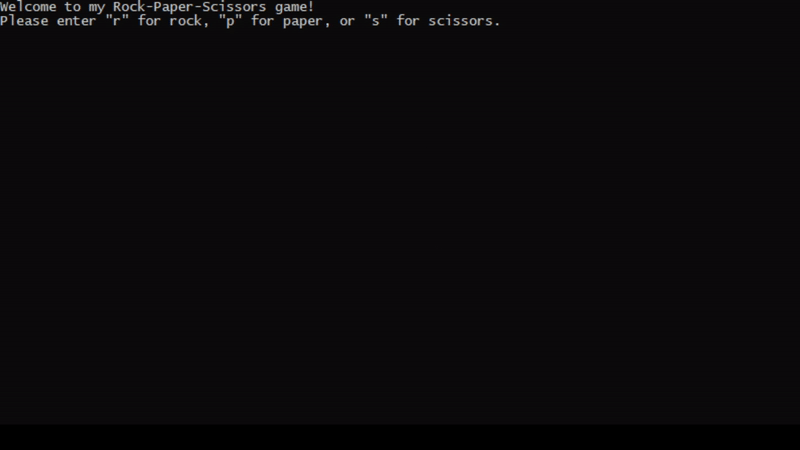
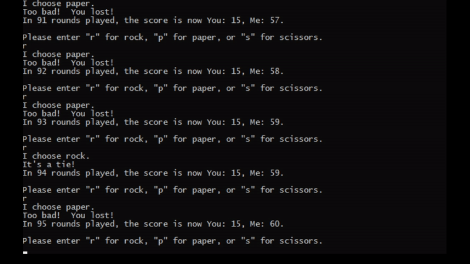

# Examples:

* This one shows normal usage, plus what happens when a user gives an incorrect input.

* This one shows an example of the program "learning" from a user who almost exclusively picked rock.

